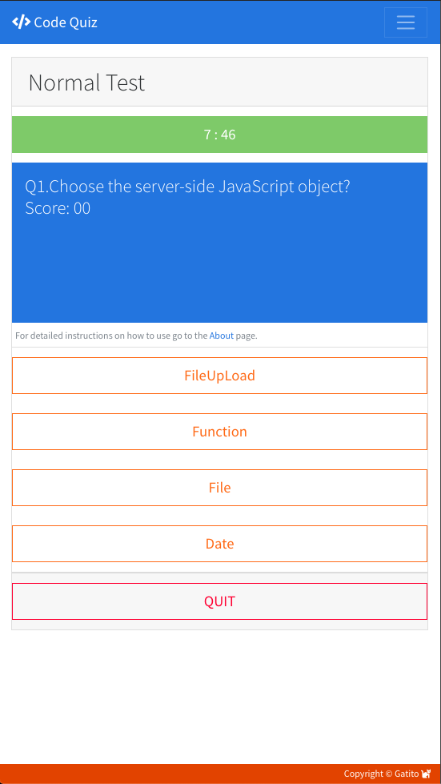

# 04 Web APIs: Code Quiz

Create an application that will present user with a Javascript multiple choice quiz, based on user-selected criteria in order to exercise key concepts like programing logic, flow control, division of concerns, array handling, local storage and dynamic object creation in DOM.

## 1. Guidelines

User Story and Acceptance Criteria were provided in the original `README.md` along with a GIF animation to provide a better sense of what was the target objective of the assignment. All of these inputs were taken into account when deciding the actual implementation route. Listed below is a review of these guidelines provided for the assignment.

### 1.1. Provided User Story.

AS A coding bootcamp student
I WANT to take a timed quiz on JavaScript fundamentals that stores high scores
SO THAT I can gauge my progress compared to my peers

### 1.2. Acceptance Criteria Checklist.

The following section takes the requirements provided in the homework assignment and we do a step by step crosscheck of each of the acceptance criterias while also providing feedback and comments. 

#### 1.2.1 Initial Criteria.

* Build a timed code quiz with multiple-choice questions. 
- [x] Done --- Issac.

* This app will run in the browser and feature dynamically updated HTML and CSS powered by your JavaScript code. It will also feature a clean and polished user interface and be responsive, ensuring that it adapts to multiple screen sizes. 
- [x] Done --- Issac.

#### 1.2.2. Detailed Acceptance Criteria.

GIVEN I am taking a code quiz:

* WHEN I click the start button, THEN a timer starts and I am presented with a question.
- [x] After clicking `START` button user is asked to register name and select difficulty level. Hard Mode = 5 min, Normal Mode = 8 min or Easy Mode = 10 min. After that quiz begins, 1st question is displayed and timer begins to countdown.

* WHEN I answer a question, THEN I am presented with another question.
- [x] Quiz consists of 10 questions.

* WHEN I answer a question incorrectly, THEN time is subtracted from the clock.
- [x] if answered incorrectly user can get penalizd with 20, 30 or 40 seconds subtracted from the clock. Whenever user is penalized a message is displayed in the UI.

* WHEN all questions are answered or the timer reaches 0, THEN the game is over.
- [x] User will get prompted Halfway thorugh, 20 seconds left, 10 seconds left and if time ran out. If time ran out user's score wont be submitted.

* WHEN the game is over, THEN I can save my initials and score.
- [x] Switched user registration to the beginning of the flow, since I think its a better user experience and forces the user to register first this avoiding any unregistered quizes.

### 1.3. Deliverables.

* The URL of the deployed application.
- [x] https://carlosissac.github.io/mod04hwcodequiz/ --- Issac.

* The URL of the GitHub repository. Give the repository a unique name and include a README describing the project.
- [x] https://github.com/carlosissac/mod04hwcodequiz. Name of the repo is `mod04hwcodequiz`, a new `README.md` detailing the development process is also provided and displayed. --- Issac

## 2. Features and Comments.

The following section details the development decisions and implementation routes taken for this assignment.

## 2.1. UI Design.

